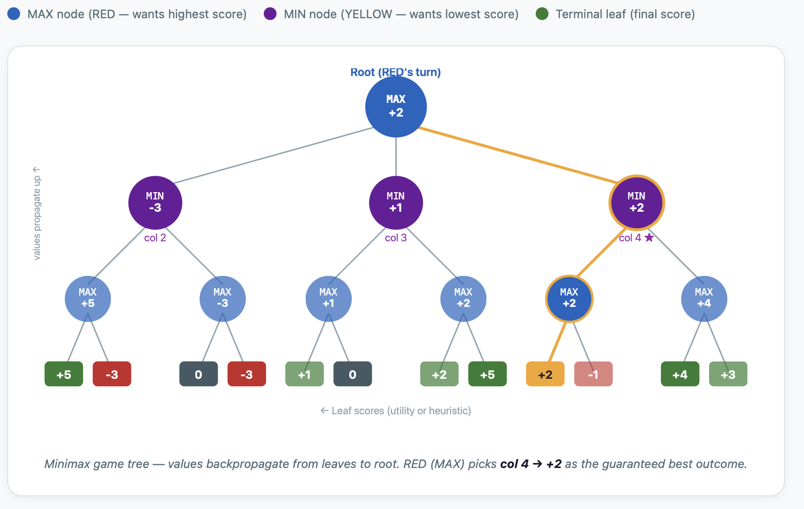
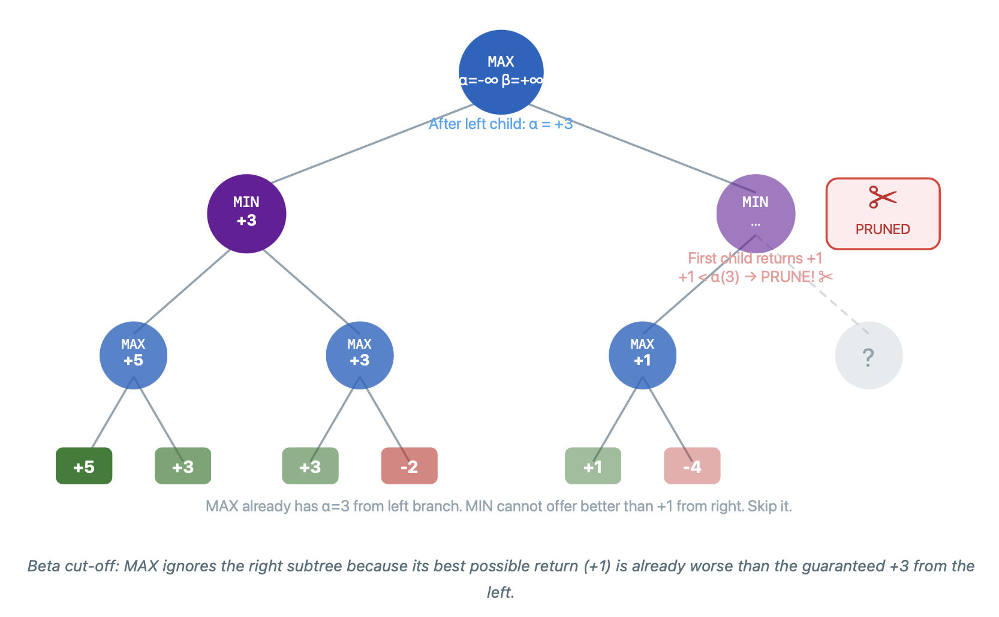
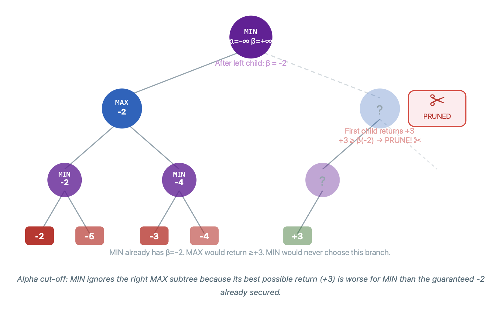
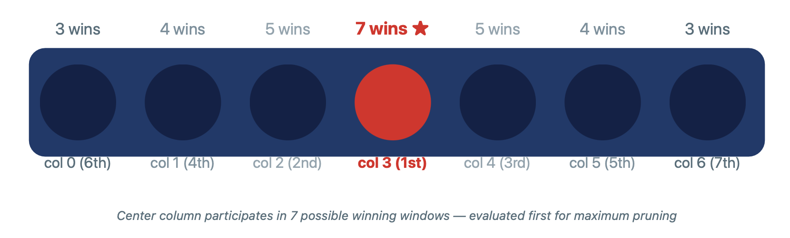
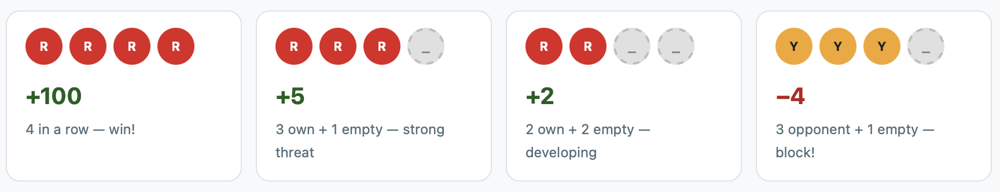

# Connect Four

This project implements a Connect Four AI, developed after studying search algorithms in **CS50’s Introduction to Artificial Intelligence with Python** .

Building on a prior Tic-Tac-Toe implementation, this project explores more advanced concepts such as **Minimax with Alpha-Beta Pruning** and **heuristic evaluation** to handle the significantly larger search space of Connect Four. The AI is designed to play **strong, near-optimal moves** while maintaining real-time performance.

---

## Objective

Build an AI agent that:
- Evaluates all possible future game states up to a configurable depth
- Selects the **optimal column** to drop a piece each turn
- Plays a **near-perfect game** of Connect Four against a human opponent
- Blocks opponent threats while pursuing its own winning lines

---

## Concepts Covered

- **Minimax algorithm** for adversarial search
- **Alpha-Beta Pruning** to eliminate branches that can't affect the result
- **Heuristic evaluation** of non-terminal board states (windowed scoring)
- Game tree construction and traversal
- Terminal state detection (win, loss, draw)
- Gravity simulation (pieces fall to the lowest available row)

---

## Project Structure

```
connectfour/
├── connectfour.py      # Core game logic and Minimax AI implementation
├── runner.py           # Pygame-based GUI
├── requirements.txt    # Dependencies
└── README.md
```

---

## How It Works

### Board Representation

- The board is a **6×7 grid** (`ROWS × COLS`) of states (`R`, `Y`, or `None`)
- Red (`R`) always moves first
- A valid move is any **column** that still has an empty top cell
- Pieces fall under gravity to the **lowest empty row** in the chosen column

---

## Algorithm Deep Dive

### Part 1 — Minimax

#### What Is Minimax?

Minimax is an **adversarial search algorithm** used in two-player zero-sum games.  
It assumes **both players play optimally** and recursively evaluates every possible  
future game state to find the best move.

The two players are assigned opposing roles:

| Player | Role | Goal |
|--------|------|------|
| RED    | **MAX** | Maximize the score |
| YELLOW | **MIN** | Minimize the score |

#### The Core Idea

From any board state, the AI asks:

> *"If I make this move, and my opponent plays perfectly, what is the best outcome I can guarantee?"*

This is answered by recursively expanding the game tree:



- **Leaf nodes** are scored using the **utility function** (terminal) or **heuristic** (depth limit)
- Values **propagate upward**: MAX picks the highest child, MIN picks the lowest


#### Why Does Minimax Work?

The algorithm works because it models the **worst case from your perspective**.  
Instead of hoping your opponent blunders, you choose the move that is best  
**assuming they play perfectly**.

This guarantee means:
- If there is a winning move, Minimax finds it
- If the game is a forced draw, Minimax holds the draw
- The AI never plays a losing move when a better one exists

#### Minimax and Connect Four

Connect Four has ~4 trillion possible game states — full Minimax is computationally  
infeasible. Two additions make it practical:

1. **Depth limit** — stop expanding at a fixed depth and evaluate with a heuristic
2. **Alpha-Beta Pruning** — skip branches that cannot possibly affect the result

---

### Part 2 — Alpha-Beta Pruning

#### What Is Alpha-Beta Pruning?

Alpha-Beta Pruning is an **optimization of Minimax** that eliminates branches  
from the search tree that are provably irrelevant to the final decision.

It introduces two values tracked throughout the search:

| Variable | Maintained by | Meaning |
|----------|--------------|---------|
| `alpha`  | MAX player   | Best score MAX is **guaranteed** so far |
| `beta`   | MIN player   | Best score MIN is **guaranteed** so far |

The key insight:

> If MIN finds a move that gives a score <= alpha, MAX will never go down this  
> branch — MAX already has something better. **Prune it.**
>
> If MAX finds a move that gives a score >= beta, MIN will never go down this  
> branch — MIN already has something better. **Prune it.**


#### Worked Example — Beta Cut-off (pruning a MIN node)

When MAX already has a guaranteed score better than what MIN is offering, MAX ignores that MIN subtree entirely.



#### Worked Example — Alpha Cut-off (pruning a MAX node)

When MIN already has a guaranteed score lower than what MAX is offering, MIN ignores that MAX subtree entirely.



#### How Much Does Pruning Help?

Without pruning, Minimax at depth `d` with branching factor `b` evaluates:

```
O(b^d)  nodes
```

With Alpha-Beta Pruning and perfect move ordering:

```
O(b^(d/2))  nodes  — the square root of the original
```

This effectively **doubles the searchable depth** in the same time budget.

| Depth | Without Pruning | With Pruning (ideal) |
|-------|----------------|----------------------|
| 4     | 2,401 nodes    | ~49 nodes            |
| 6     | 117,649 nodes  | ~343 nodes           |
| 8     | 5,764,801 nodes| ~2,401 nodes         |

#### Move Ordering and Pruning Efficiency

Alpha-Beta Pruning is most effective when **the best moves are evaluated first**.  
If good moves are evaluated late, fewer branches get pruned.

This project uses center-first column ordering based on Connect Four strategy:

```python
COL_ORDER = [3, 2, 4, 1, 5, 0, 6]
```

Center columns are explored first because the center (col 3) participates  
in the most possible winning windows. 



* Column 3 (center) → part of 7 winning lines (best)
* Columns 2 and 4 → part of 5 winning lines
* Columns 1 and 5 → part of 4 winning lines
* Columns 0 and 6 → part of 3 winning lines (worst)


This ordering ensures the AI explores stronger moves first.

---

### Part 3 — Depth Limit and Heuristic Evaluation

#### Why a Depth Limit?

Connect Four's game tree is too large for exhaustive search:

| Factor | Value |
|--------|-------|
| Board size | 6 × 7 = 42 cells |
| Average branching factor | ~7 |
| Max game length | 42 moves |
| Possible game states | ~4.5 trillion |

At depth 5 with Alpha-Beta Pruning, the AI evaluates far fewer nodes and  
responds in well under one second.

#### The Heuristic Function

When the search reaches its depth limit without hitting a terminal state,  
the board is **scored with a heuristic** instead of a utility value.

The heuristic evaluates the board by sliding a **window of 4 consecutive cells**  
across every possible direction and scoring each window:

**Example windows evaluation:**



* More of your pieces → higher score
* More opponent pieces → lower score

**All directions scanned:**

```
Horizontal:   6 rows  x 4 windows = 24 windows
Vertical:     3 rows  x 7 cols    = 21 windows
Diagonal (v): 3 rows  x 4 cols    = 12 windows
Diagonal (^): 3 rows  x 4 cols    = 12 windows
                               Total = 69 windows per board
```

**Window scoring table:**

| Window contents             | Score  | Reason |
|-----------------------------|--------|--------|
| 4 own pieces                | `+100` | Winning line |
| 3 own + 1 empty             | `+5`   | Strong threat |
| 2 own + 2 empty             | `+2`   | Developing position |
| 3 opponent + 1 empty        | `-4`   | Must block |
| Center column piece (bonus) | `+3`   | Strategic position |

The final board score is:

```
score = sum(score_window(w, RED)) - sum(score_window(w, YELLOW))
```

* A positive result favors RED; 
* A negative result favors YELLOW.

---


## Controls

| Input        | Action                      |
|--------------|-----------------------------|
| Click column | Drop piece into that column |
| Keys `1-7`   | Drop piece into column 1-7  |
| Key `R`      | Restart (return to menu)    |
| Play Again   | Button after game ends      |

---

## Game Visualization

*A step-by-step visual of the AI making decisions during a live game.*


https://github.com/user-attachments/assets/f7bc0a42-12fa-444d-8588-77d3c8b62873


---

## Usage

Install dependencies:

```bash
pip install -r requirements.txt
```

Run the game:

```bash
python runner.py
```

Choose to play as **Red** or **Yellow** — the AI takes the other side.  
Red always goes first.

---

## Configuration

In `connectfour.py`, you can tune:

```python
DEPTH = 5   # Search depth — increase for stronger AI (slower)
```

| Depth | Strength | Approx. move time | Nodes evaluated (est.) |
|-------|----------|--------------------|------------------------|
| 3     | Beginner | < 0.1s             | ~500                   |
| 5     | Strong   | ~0.3-0.5s          | ~5,000                 |
| 7     | Expert   | ~3-5s              | ~50,000                |

---

## Notes

- Language: **Python 3**
- GUI Library: **Pygame**
- Algorithm: **Minimax + Alpha-Beta Pruning + Heuristic evaluation**
- At depth 5, the AI plays a very strong game — beating it requires setting up  
  two simultaneous threats (a "7-trap") that the AI cannot both block at once
